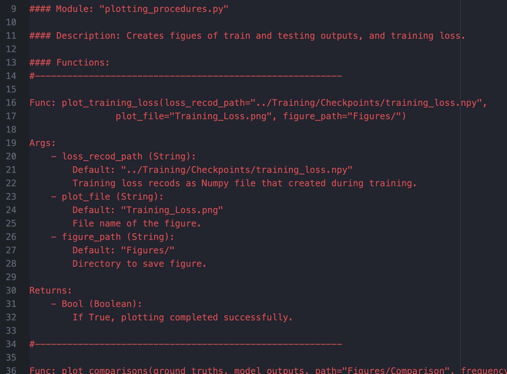

# PI-rCNN
## An unsupervised latent/output physics-informed convolutional-LSTM network for solving partial differential equations using peridynamic differential operator

<hr/>

<b>
Arda Mavi <sup>1</sup> <br/>
Ali Can Bekar <sup>1</sup> <br/>
Ehsan Haghighat <sup>2</sup> <br/>
Erdogan Madenci <sup>1</sup> <br/>
</b>
<br/>
<sup>1</sup> University of Arizona, Tucson, AZ<br/>
<sup>2</sup> Massachusetts Institute of Technology, Cambridge, MA<br/><br/>

<b>Paper:</b> [arXiv:2210.12177](https://arxiv.org/abs/2210.12177)
<br/>

|<center>Burgers’<br/>Equation</center>|<center>λ − ω Reaction-Diffusion<br/>Equation</center>|<center>Gray-Scott<br/>Equation</center>|
|:-:|:-:|:-:|
|<br/><br/>|<br/><br/>|<br/><br/>|

<hr/>

### README Contents:
- [Running the Code](#running-the-code)
- [Modules](#modules)
-- [Main Pipeline](#main-pipeline)
-- [Pipeline options](#pipeline-options)
-- [PDDO Kernels](#pddo-kernels)
-- [Model Procedures](#model-procedures)
-- [Training Procedure](#training-rocedure)
-- [Plotting Procedure](#plotting-procedure)
- [Data Generation](#data-generation)
- [Envoriment Versions](#envoriment-versions)
- [Hardware](#hardware)
- [Sample SLURM Job](#sample-slurm-job)
- [Cite as](#cite-as)

<br/><hr/>

# Running the Code
- Fulfill the environment requirements, see [Envoriment Versions](#envoriment-versions)
- Download the Repository
- Create a `Dataset/` folder under `code`.<br/>Save the dataset (see [Data Generation](#data-generation) section) in it with name `dataset.npy` as Numpy file.
- Change directory to `code/Main_Pipeline`
- Run main pipeline using `python main_pipeline.py` or see [Sample SLURM Job](#sample-slurm-Job) <br/>
Trained model parameters will be saved into `code/Main_Pipeline/Checkpoints/Model` <br/>
All the train and test figures will be saved into `code/Main_Pipeline/Main_Outputs/Figures`
<br/><br/>

<hr/>

# Modules
Detailed module documentations can be found in the module files, e.g. :

|<center>`code/Plotting/plotting_procedures.py`</center>|
|:-:|
||


## Main Pipeline:
File: `code/Main_Pipeline/main_pipeline.py`<br/>
Creating, training, and testing model and plotting the figures.

#### Pipeline options:

- `python main_pipeline.py -m train` creates and trains the model.
- `python main_pipeline.py -m plot` plots the figures using existed model.
- Use `-m train plot` arguments together or leave blank to run both pipeline.


## PDDO Kernels:
Folder: `code/PDDO_Kernels`
<br/>
Keeps Peridynamic kernel files as `.mat` format.

## Model Procedures:
File: `code/Model/model_procedure.py`
<br/>
Prepares model and loss functions.

## Training Procedure:
File: `code/Training/training_procedure.py`
<br/>
Model training procedure.

## Plotting Procedure:
File: `code/Plotting/plotting_procedure.py`
<br/>
Plotting of training loss, several comparison figures, and GIF animations of data during time.
<br/><br/>

<hr/>

# Data Generation

- Burgers’ Equation : [Repo](https://github.com/isds-neu/PhyCRNet/tree/main/Datasets)
- λ − ω Reaction-Diffusion Equation : [Repo](https://github.com/snagcliffs/PDE-FIND/tree/master/Datasets)
- Gray-Scott Equation : [Repo](https://github.com/chebfun/examples/blob/master/pde/GrayScott.m)

<br/>

<hr/>

# Envoriment Versions
- CentOS 7
- Anaconda 3
- Conda 4.9.2
- Python 3.6.13
- \* CUDA 11.6
- \* CuDNN 8.2.1.32
- \* Cudatoolkit 10.2.89
- Necessary Python modules can be installed using `pip install -r library_requirements.txt` command.
<br/>

<i>\* Optional for CPU usages. Required to take advantage of GPU and multi-GPU feature.</i>
<br/><br/>

<hr/>

# Hardware
- <b>Device Model:</b> Penguin Altus XE2242<br/>
- <b>CPU:</b> AMD EPYC 7642 - 48 Cores - 2.4 GHz<br/>
- <b>Memory:</b> 4 GB<br/>
- \* <b>GPU:</b> NVIDIA V100S - 32 GB
<br/>

<i>\* Due to a bug we had with the TensorFlow library, only 22.4 GB out of 32 GB was allocated as the maximum GPU memory limit while testing GPU features.</i>
<br/><br/>

<hr/>

# Sample SLURM Job
Sample SLURM Job script can be found with name `slurm_job.sh` under the `Sample_Slurm_Job/` directory.<br/>
<i><b>Caution:</b> Change the `<...>` parts.</i>
<br/><br/>

<hr/>

# Cite as
```
@misc{mavi2022unsupervised,
      title={An unsupervised latent/output physics-informed convolutional-LSTM network for solving partial differential equations using peridynamic differential operator},
      author={A. Mavi and A. C. Bekar and E. Haghighat and E. Madenci},
      year={2022},
      eprint={2210.12177},
      archivePrefix={arXiv},
      primaryClass={cs.LG}
}
```

<br/><br/>
